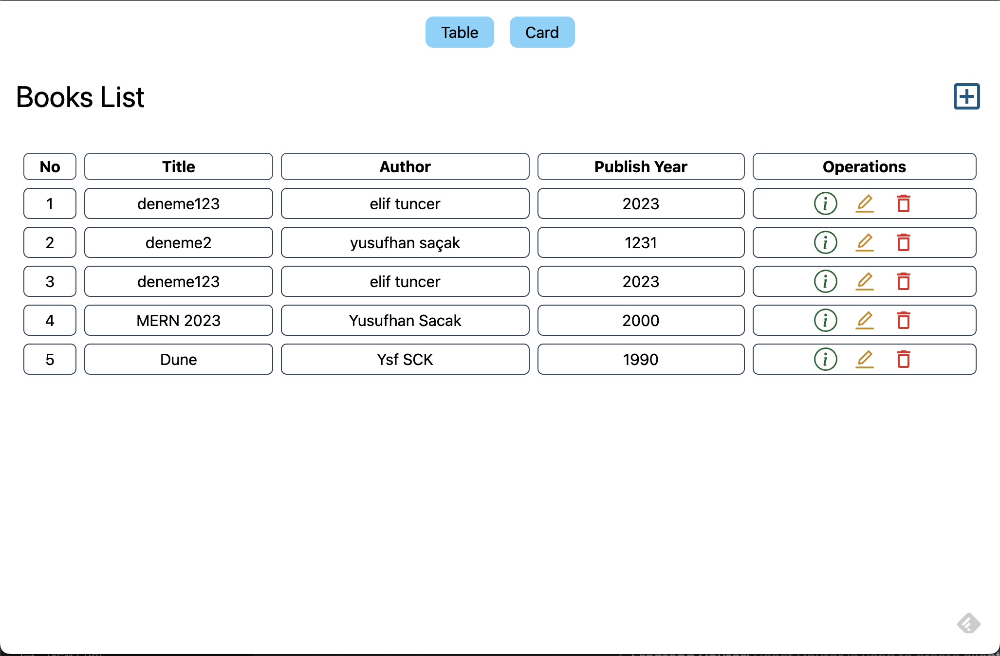
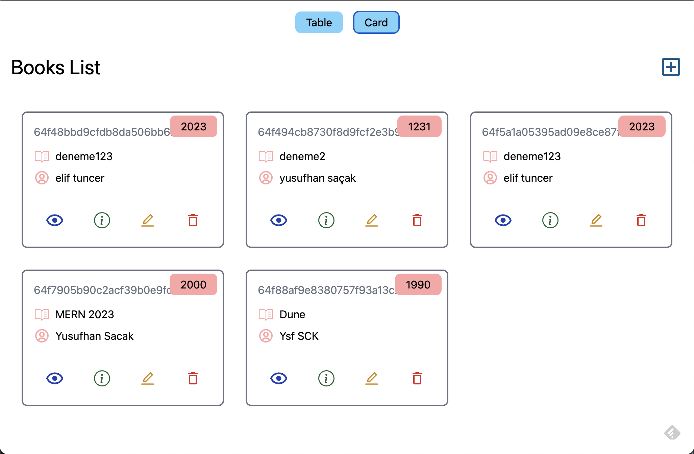
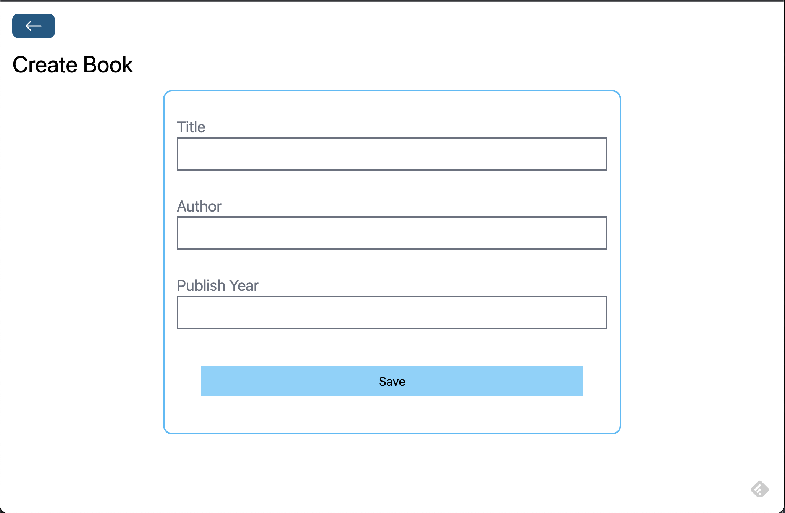
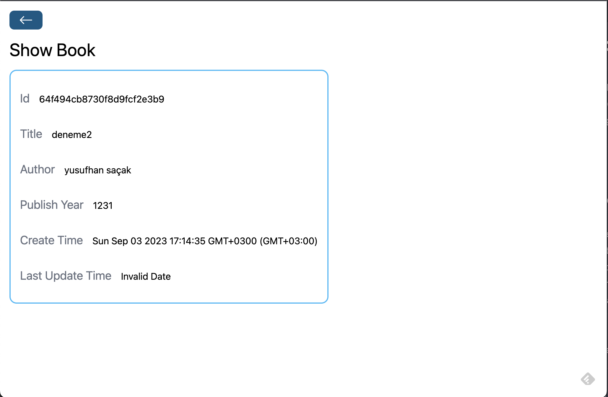
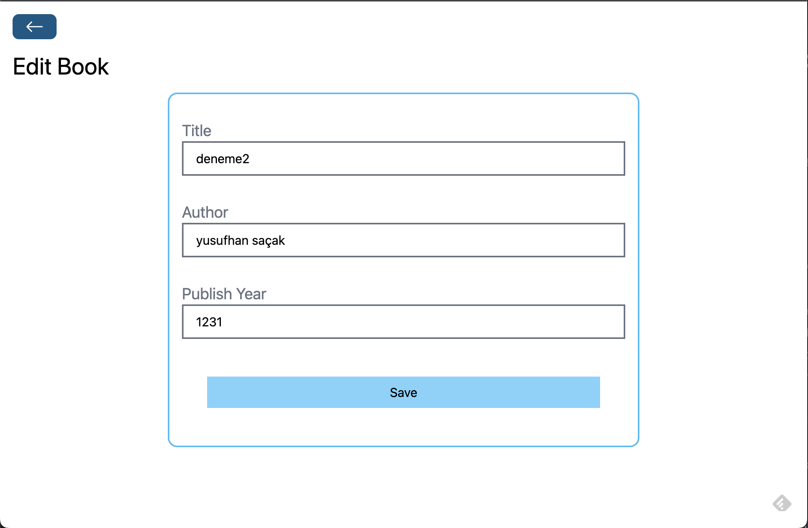
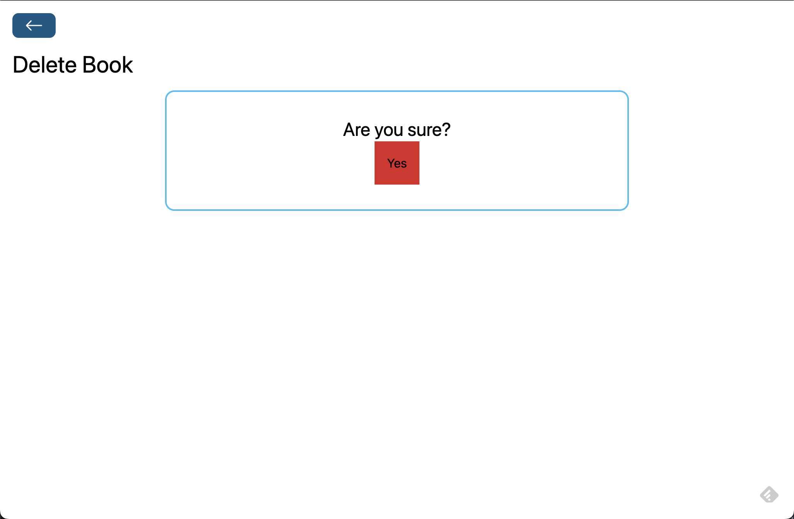

# ReadRipple: Your Digital Book Haven
Book Store Project (MERN STACK)
## Overview

Welcome to ReadRipple! This is a digital bookstore project built using the MERN stack (MongoDB, Express.js, React, and Node.js). It’s a space where you can browse, read, and manage your favorite books with ease. This project showcases basic CRUD (Create, Read, Update, Delete) operations on both the backend and frontend, with smooth routing and CORS policy configuration.

## What’s Inside?

- **Backend Magic:** Our backend handles all the CRUD operations for book management. You can add, view, update, and delete books effortlessly.
- **Seamless Routing:** With Express.js, we’ve set up clean and efficient routing. Each CRUD operation has its own route and controller.
- **CORS Friendly:** Cross-Origin Resource Sharing (CORS) is configured to ensure that our frontend and backend communicate smoothly.
- **MongoDB Love:** MongoDB powers our database operations, keeping all your book data safe and sound.
- **Frontend Delight:** The frontend is all about user experience. You can add new books, view the collection, edit book details, and delete books.
- **Smooth Navigation:** React Router ensures seamless navigation between different pages of our application.

## Getting Started

Ready to dive in? Follow these steps to get ReadRipple up and running on your machine:

### 1. Clone the Repo

```bash
git clone https://github.com/Sanaalagh/ReadRipple
cd ReadRipple
```

### 2. Backend Setup

Navigate to the backend directory and install the necessary packages:

```bash
cd backend
npm install
```

Create a `.env` file in the backend directory and add your MongoDB URI:

```env
MONGODB_URI=mongodb://localhost:27017/readripple
```

Start the backend server:

```bash
npm run dev
```

### 3. Frontend Setup

Open a new terminal and navigate to the frontend directory:

```bash
cd frontend
npm install
npm run dev
```

## Tech Stack

### Backend:
- Node.js
- Express.js
- MongoDB

### Frontend:
- Vite
- React

## Screenshots

Check out some screenshots of ReadRipple in action:








## About the Project

ReadRipple was inspired by a desire to make digital books easily accessible and manageable. It started as a simple idea and grew into a project that I’m proud to share.

## Meet the Creator

Hey there! I’m LAGHZOU SANAA , the developer behind ReadRipple. Feel free to reach out if you have any questions or feedback:

- **Email:** Sanaalaghzou@gmail.com
- **LinkedIn:** (https://www.linkedin.com/in/sanaa-laghzou/)
- **GitHub:** (https://github.com/Sanaalagh)
- **Twitter:** (https://x.com/SanaaLaghzou)

## License

This project is open source and available under the [MIT License](LICENSE).

## Acknowledgements

I would like to express my gratitude to everyone who supported and encouraged me throughout this project. Special thanks to:

The open-source community for providing invaluable resources and inspiration.
My friends and family for their constant support and understanding.
The developers and contributors of the MERN stack technologies for creating such powerful tools.


